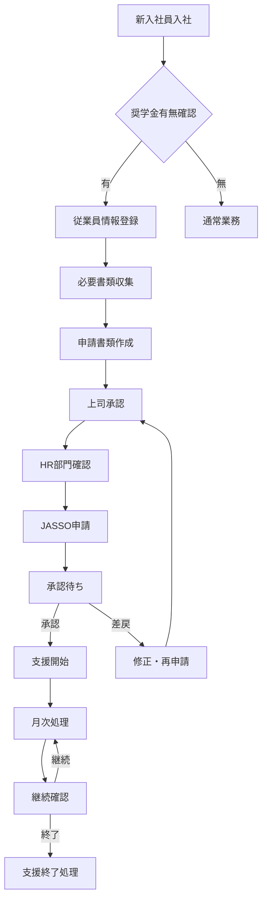

# 📋 奨学金代理返還業務フローガイド

> **企業における奨学金代理返還業務の完全ワークフロー**

## 🎯 業務フロー全体図



---

## 🏢 Phase 1: 新入社員対応フロー

### **入社時チェックリスト**
```
□ 奨学金借入有無の確認
□ 借入額・返還状況の確認
□ 支援希望の意思確認
□ JASSO ID の確認
□ 必要書類の説明・依頼
```

### **システム操作手順**
1. **従業員管理画面で新規登録**
   ```
   基本情報入力:
   ✅ 従業員ID: EMP-YYYYMMDD-XXX
   ✅ 氏名・連絡先
   ✅ 部署・役職
   ✅ 入社日
   
   奨学金情報:
   ✅ 奨学金対象: 有
   ✅ 現在の月額返還額
   ✅ 希望支援額
   ✅ JASSO ID（後日追加可）
   ```

2. **必要書類の案内**
   ```
   従業員に依頼する書類:
   📄 奨学金返還証明書
   📄 在職証明書（HR部門で作成）
   📄 代理返還同意書
   📄 銀行口座確認書
   ```

---

## 📄 Phase 2: 申請書類作成フロー

### **書類準備チェックリスト**
```
□ 奨学金返還証明書（JASSO発行・原本）
□ 在職証明書（会社発行・3ヶ月以内）
□ 代理返還同意書（本人署名・印鑑）
□ 銀行口座確認書（通帳コピー等）
□ 身元保証書（必要に応じて）
```

### **システム操作手順**
1. **申請管理画面で新規申請作成**
   ```
   申請情報入力:
   ✅ 申請者選択
   ✅ 奨学金種別（第一種/第二種/給付型）
   ✅ 月額返還額
   ✅ 会社支援額（上限確認）
   ✅ 支援開始予定日
   ✅ 支援終了予定日
   ```

2. **書類アップロード**
   ```
   各書類をPDF化してアップロード:
   📁 返還証明書.pdf
   📁 在職証明書.pdf
   📁 同意書.pdf
   📁 口座確認書.pdf
   ```

3. **申請内容確認・提出**
   ```
   最終チェック項目:
   ✅ 申請者情報の正確性
   ✅ 金額の妥当性
   ✅ 書類の完備
   ✅ 会社規定との整合性
   ```

---

## ✅ Phase 3: 承認プロセスフロー

### **承認階層**
```
1次承認: 直属上司
2次承認: 部門長
3次承認: HR部門
最終承認: 役員（金額に応じて）
```

### **承認者向け確認項目**
```
□ 申請者の在職状況
□ 奨学金情報の正確性
□ 支援額の妥当性
□ 会社規定への適合
□ 予算への影響
□ 書類の完備
```

### **システム操作（承認者）**
1. **申請通知の確認**
   - メール通知またはシステム内通知
   - ダッシュボードの「承認待ち」を確認

2. **申請内容レビュー**
   ```
   確認画面で以下をチェック:
   👤 申請者情報
   💰 奨学金・支援額情報
   📄 添付書類
   📅 支援期間
   ```

3. **承認または差戻**
   ```
   承認: 「承認」ボタン + コメント（任意）
   差戻: 「差戻」ボタン + 理由入力（必須）
   ```

---

## 🤝 Phase 4: JASSO申請フロー

### **JASSO申請前チェック**
```
□ 社内承認の完了
□ 書類の最終確認
□ JASSO システムの稼働確認
□ 申請期限の確認
□ 企業コードの確認
```

### **システム操作手順**
1. **JASSO連携画面で申請準備**
   ```
   申請データ確認:
   📋 対象申請の選択
   👥 申請者情報の確認
   💰 支援額の確認
   📄 必要書類の確認
   ```

2. **JASSO形式データ生成**
   ```
   自動生成項目:
   ✅ 企業情報
   ✅ 申請者情報
   ✅ 奨学金情報
   ✅ 支援内容
   ```

3. **JASSO システムへの送信**
   ```
   送信処理:
   🔄 データ送信実行
   📧 送信完了通知
   📋 受領番号の記録
   📅 審査結果待ち状態に更新
   ```

---

## 💰 Phase 5: 月次支援処理フロー

### **月次処理スケジュール**
```
毎月25日: 翌月支援対象者確認
毎月末日: 支援額確定・経理データ作成
翌月5日: JASSO月次報告
翌月10日: 従業員への支援通知
翌月15日: 支援金振込実行
```

### **月次処理手順**
1. **支援対象者確認（月末）**
   ```
   確認項目:
   ✅ 継続支援対象者
   ✅ 新規支援開始者
   ✅ 支援終了者
   ✅ 支援額変更者
   ```

2. **経理データ作成**
   ```
   レポート生成:
   📊 支援対象者リスト
   💰 支援額一覧
   📈 月次支援総額
   📋 振込先情報
   ```

3. **JASSO月次報告**
   ```
   報告内容:
   📄 実施支援件数
   💰 実施支援総額
   👥 新規開始者情報
   👥 支援終了者情報
   ```

---

## 📊 Phase 6: 継続管理フロー

### **定期確認業務**
```
【毎月】
□ 支援継続状況確認
□ 書類有効期限確認
□ 従業員在職状況確認
□ 支援額変更の有無

【四半期】
□ 支援効果測定
□ 制度利用率分析
□ 従業員満足度調査
□ システム改善検討

【年次】
□ 制度全体の見直し
□ 予算計画の更新
□ 規程の改定検討
□ 税務・会計処理確認
```

### **変更管理手順**
1. **支援額変更時**
   ```
   変更トリガー:
   🔄 奨学金返還額の変更
   🔄 従業員の昇格・昇給
   🔄 会社規程の改定
   🔄 家計状況の変化
   ```

2. **支援終了時**
   ```
   終了事由:
   ✅ 奨学金完済
   ✅ 従業員退職
   ✅ 規程違反
   ✅ 本人希望
   ```

---

## 🚨 Phase 7: 例外・トラブル対応フロー

### **よくある問題と対応**

#### **書類不備の場合**
```
対応手順:
1️⃣ 不備内容の明確化
2️⃣ 従業員への連絡・説明
3️⃣ 再提出依頼・期限設定
4️⃣ 再審査・承認プロセス
```

#### **JASSO申請エラーの場合**
```
対応手順:
1️⃣ エラー内容の確認
2️⃣ システムログの確認
3️⃣ データ修正・再送信
4️⃣ JASSO担当者への連絡（必要時）
```

#### **従業員退職時の対応**
```
対応手順:
1️⃣ 支援終了日の確定
2️⃣ 最終支援額の算出
3️⃣ JASSO終了申請
4️⃣ 経理処理・精算
5️⃣ 書類の保管・整理
```

---

## 📈 業務効率化のポイント

### **効率化Tips**
```
⚡ 定型書類のテンプレート化
⚡ 申請期限カレンダーの活用
⚡ 自動リマインダー設定
⚡ バッチ処理の活用
⚡ レポート自動生成
```

### **品質向上Tips**
```
🎯 チェックリストの徹底活用
🎯 ダブルチェック体制
🎯 エラーログの定期確認
🎯 従業員フィードバック収集
🎯 継続改善活動
```

---

## 📞 サポート・エスカレーション

### **問題レベル別対応**
```
Level 1 (軽微): FAQ・マニュアル参照
Level 2 (通常): サポートデスクに連絡
Level 3 (緊急): 管理者・開発チームに直接連絡
Level 4 (重大): 経営層・外部専門家を含む対応
```

### **連絡先情報**
```
📧 一般サポート: support@scholarship-system.com
📞 電話サポート: 03-XXXX-XXXX
💬 チャットサポート: システム内機能
🆘 緊急連絡: emergency@scholarship-system.com
```

---

> **🎯 業務フロー成功の鍵**  
> **標準化されたプロセス**と**システムの効果的活用**により、  
> 奨学金代理返還業務を効率的かつ確実に実行できます。  
> 
> **定期的な見直し**と**継続的な改善**で、  
> さらなる業務品質向上を目指しましょう！

**バージョン**: 1.0.0  
**最終更新**: 2025年1月26日  
**作成者**: 新規事業立ち上げチーム