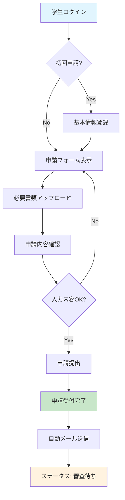
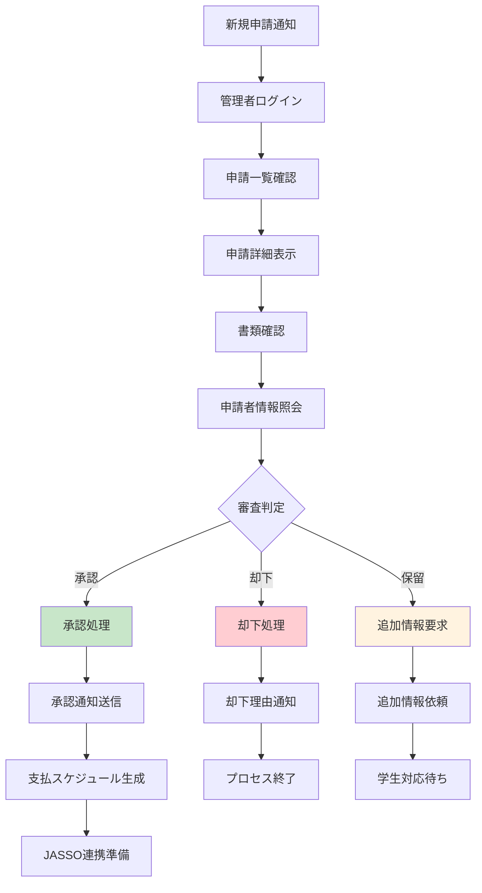
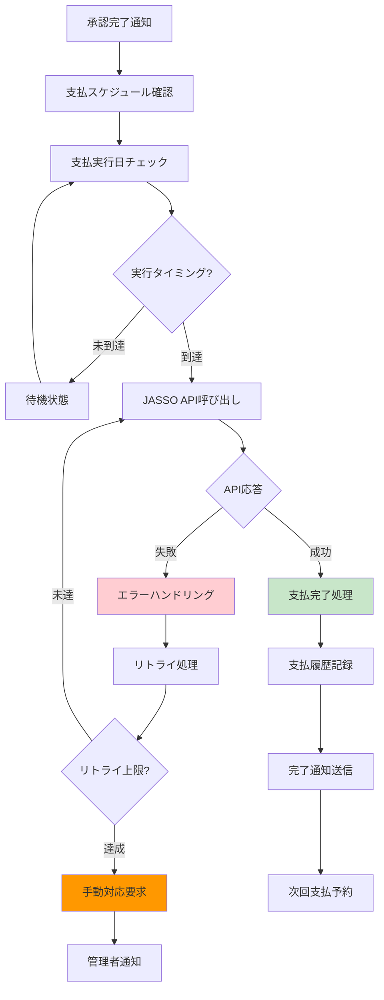
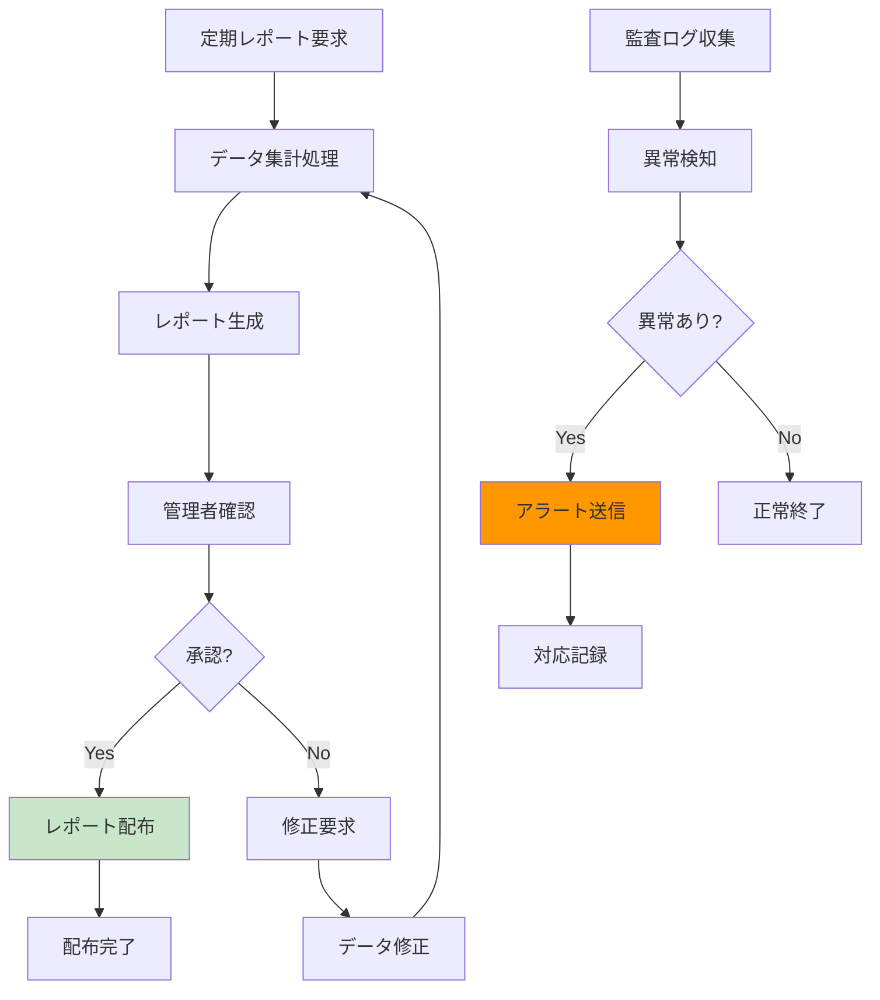

# 業務フロー図・業務プロセス定義書
## 奨学金代理返済支援システム

**文書バージョン**: 1.0  
**作成日**: 2025-08-28  
**対象**: ビジネスアナリスト、システム設計者、開発チーム

---

## 1. 業務プロセス概要

### 1.1 主要業務プロセス
奨学金代理返済支援システムでは、以下の4つの主要業務プロセスを管理します：

1. **申請プロセス**: 学生による代理返済申請
2. **審査プロセス**: 管理者による申請審査・承認
3. **支払プロセス**: JASSOへの代理返済実行
4. **監査プロセス**: 全工程の監査・レポート

### 1.2 関係者（ステークホルダー）
- **学生**: 奨学金返済支援を申請する利用者
- **企業**: 学生の奨学金返済を代理で支援する組織
- **管理者**: システム管理・申請審査を行う担当者
- **JASSO**: 日本学生支援機構（外部システム）
- **システム管理者**: 技術的な運用・保守を行う担当者

---

## 2. 申請プロセス（AS-IS / TO-BE）

### 2.1 AS-IS（現状プロセス）

```
学生側の現状プロセス:
┌─────────────┐
│ 1. 手作業での │
│    書類作成   │
└─────┬───────┘
        │
┌─────▼───────┐
│ 2. 郵送・FAX │
│    での提出   │
└─────┬───────┘
        │
┌─────▼───────┐
│ 3. 審査待ち   │
│   (不透明)    │
└─────┬───────┘
        │
┌─────▼───────┐
│ 4. 電話・メール│
│    での結果通知│
└─────────────┘

企業側の現状プロセス:
┌─────────────┐
│ 1. Excelでの │
│    申請管理   │
└─────┬───────┘
        │
┌─────▼───────┐
│ 2. 手作業での │
│    審査・確認 │
└─────┬───────┘
        │
┌─────▼───────┐
│ 3. JASSOへの │
│    個別連絡   │
└─────┬───────┘
        │
┌─────▼───────┐
│ 4. 手作業での │
│    支払処理   │
└─────────────┘
```

### 2.2 TO-BE（システム化後プロセス）

```
統合デジタルプロセス:

学生 ─────┐
         │
企業 ─────┼── システム ──── JASSO
         │      │
管理者 ───┘      │
                │
            監査ログ

フロー詳細:
┌─────────────┐    ┌─────────────┐    ┌─────────────┐
│ 1. Web申請   │───▶│ 2. 自動審査   │───▶│ 3. JASSO連携 │
│   フォーム   │    │   ワークフロー │    │   自動支払   │
└─────────────┘    └─────────────┘    └─────────────┘
        │                    │                    │
        ▼                    ▼                    ▼
┌─────────────┐    ┌─────────────┐    ┌─────────────┐
│リアルタイム  │    │承認・却下    │    │支払完了     │
│ステータス更新│    │自動通知      │    │自動通知     │
└─────────────┘    └─────────────┘    └─────────────┘
```

---

## 3. 詳細業務フロー

### 3.1 申請業務フロー



**プロセス詳細説明:**

| ステップ | 処理内容 | 担当者 | 所要時間 | システム処理 |
|---------|---------|--------|----------|-------------|
| 1 | ログイン認証 | 学生 | 1分 | 認証処理、セッション管理 |
| 2 | 基本情報確認・更新 | 学生 | 5分 | データベース参照・更新 |
| 3 | 申請フォーム入力 | 学生 | 15分 | リアルタイムバリデーション |
| 4 | 必要書類アップロード | 学生 | 10分 | ファイル検証・ウイルススキャン |
| 5 | 申請内容確認 | 学生 | 5分 | データ整合性チェック |
| 6 | 申請提出 | 学生 | 1分 | 申請ID発行、データベース登録 |
| 7 | 受付完了通知 | システム | 即座 | メール自動送信 |

### 3.2 審査業務フロー



**審査基準とチェックポイント:**

| チェック項目 | 確認内容 | 判定基準 | 必要書類 |
|-------------|---------|----------|----------|
| 申請者資格 | 学生証明書の有効性 | 有効期限内、本人確認 | 学生証、身分証明書 |
| 奨学金情報 | JASSO登録情報との整合性 | 貸与番号、金額の一致 | 奨学金証書、返済予定表 |
| 企業情報 | 企業の実在性・信用性 | 法人登記、財務状況 | 登記簿謄本、決算書 |
| 支払能力 | 企業の支払能力評価 | 資本金、売上高基準 | 財務諸表、与信情報 |
| 契約関係 | 学生と企業の雇用関係 | 雇用契約書、内定通知書 | 雇用契約書、内定通知 |

### 3.3 支払業務フロー



**JASSO連携仕様:**

| 連携項目 | データ形式 | 送信タイミング | エラー処理 |
|---------|-----------|----------------|-----------|
| 支払指示 | JSON/XML | 毎月指定日 | 3回リトライ |
| 支払確認 | JSON/XML | 支払後24時間以内 | 手動確認要求 |
| 残高照会 | JSON/XML | リアルタイム | キャッシュ利用 |
| 完済通知 | JSON/XML | 完済時即座 | 重要度：高 |

### 3.4 監査・レポート業務フロー



---

## 4. 業務ルール・制約事項

### 4.1 申請ルール

#### 申請可能条件
- 日本国内の認定教育機関に在籍する学生
- JASSO奨学金の返済義務を有する者
- 企業との雇用関係（内定含む）が証明できる者
- 申請時点で延滞がない者

#### 申請制限事項
- 1学生につき1企業との契約のみ
- 月次返済額の上限: 100,000円
- 申請書類の保存期間: 7年間
- 取り消し可能期間: 申請後7日以内

### 4.2 審査ルール

#### 自動承認条件
- 企業信用度AAA以上
- 返済額50,000円以下
- 必要書類完備
- 申請者の過去トラブルなし

#### 手動審査要件
- 企業信用度A未満
- 返済額50,001円以上
- 書類不備・不明点あり
- 申請者の過去トラブルあり

### 4.3 支払ルール

#### 支払タイミング
- 毎月27日（銀行営業日）
- 年末年始・GW期間は前営業日
- JASSO指定日の3営業日前に処理開始

#### 支払処理制約
- 単発支払上限: 1,000,000円
- 日次支払上限: 50,000,000円
- API呼び出し頻度: 最大10回/分
- タイムアウト設定: 30秒

---

## 5. 例外処理・エラーハンドリング

### 5.1 システム例外

#### データベース接続エラー
```
発生条件: DB接続タイムアウト、接続プール枯渇
対応手順:
1. 自動リトライ (最大3回)
2. 管理者アラート送信
3. メンテナンスモード移行
4. 手動復旧作業
```

#### 外部API連携エラー
```
発生条件: JASSO API応答なし、認証エラー
対応手順:
1. エラーログ記録
2. 代替処理実行
3. 管理者通知
4. 手動確認・対応
```

### 5.2 業務例外

#### 申請書類不備
```
発生条件: 必要書類不足、内容不備
対応手順:
1. 申請者に自動通知
2. 修正期限設定（7日間）
3. 期限超過時は申請取り下げ
4. 再申請可能
```

#### 支払処理失敗
```
発生条件: 残高不足、口座凍結
対応手順:
1. エラー詳細の記録
2. 企業担当者に即座通知
3. 支払予定の一時停止
4. 原因解決後に再開
```

---

## 6. 性能・品質要件

### 6.1 処理性能要件

| 処理項目 | 応答時間要件 | スループット要件 | 備考 |
|---------|-------------|----------------|------|
| 申請登録 | 5秒以内 | 100件/時間 | ピーク時対応 |
| 審査処理 | 3秒以内 | 200件/時間 | 一括処理対応 |
| 支払処理 | 30秒以内 | 1000件/日 | JASSO API制約 |
| レポート生成 | 60秒以内 | 10件/時間 | 大量データ処理 |

### 6.2 可用性要件

| 項目 | 要件値 | 測定方法 | 対策 |
|------|--------|----------|------|
| システム稼働率 | 99.9%以上 | 月次測定 | 冗長化構成 |
| 計画停止時間 | 月4時間以内 | 事前通知 | メンテナンス窓 |
| 障害復旧時間 | 4時間以内 | 障害発生時 | 運用手順書 |
| データバックアップ | 日次実行 | 自動確認 | 多重バックアップ |

---

## 7. セキュリティ要件

### 7.1 認証・認可

```
認証方式:
- 多要素認証（MFA）必須
- SSO（Single Sign-On）対応
- セッションタイムアウト: 30分

認可方式:
- ロールベースアクセス制御（RBAC）
- 職務分離（Separation of Duties）
- 最小権限の原則
```

### 7.2 データ保護

```
暗号化:
- 保存時暗号化（AES-256）
- 通信時暗号化（TLS 1.3）
- キー管理（HSM使用）

個人情報保護:
- 仮名化・匿名化処理
- アクセスログ記録
- データ保存期間制限
- 削除・訂正権対応
```

---

## 8. 運用要件

### 8.1 監視要件

```
システム監視:
- CPU使用率: 80%以下
- メモリ使用率: 85%以下
- ディスク使用率: 90%以下
- ネットワーク遅延: 100ms以下

業務監視:
- 申請処理状況
- エラー発生状況
- 支払処理状況
- ユーザーアクセス状況
```

### 8.2 バックアップ・リカバリ

```
バックアップ方式:
- フルバックアップ: 週次
- 差分バックアップ: 日次
- トランザクションログ: リアルタイム

リカバリ要件:
- RTO（目標復旧時間）: 4時間
- RPO（目標復旧時点）: 1時間
- データ整合性確認: 必須
```

---

この業務フロー図・業務プロセス定義書により、システム開発チームは業務の全体像を理解し、適切なシステム設計を行うことができます。次に、システム構成図を作成いたします。